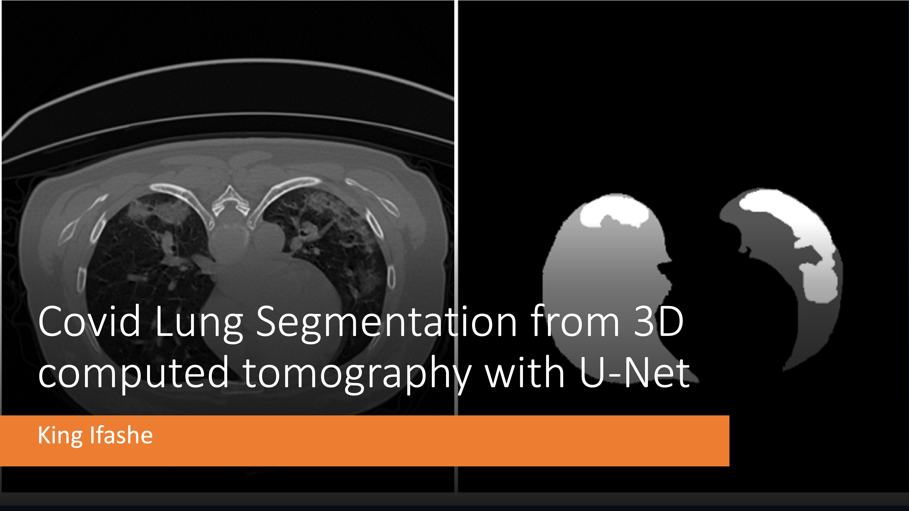
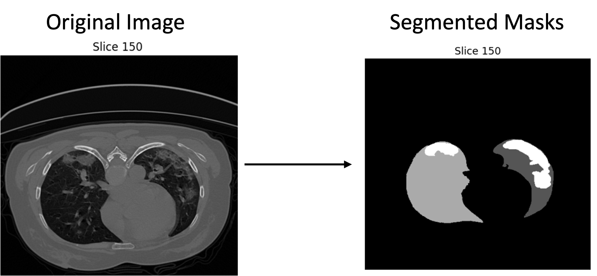
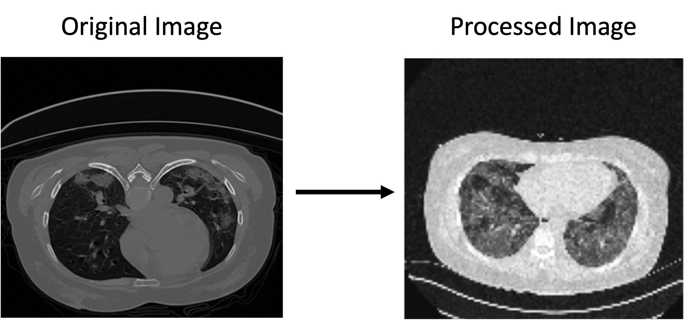
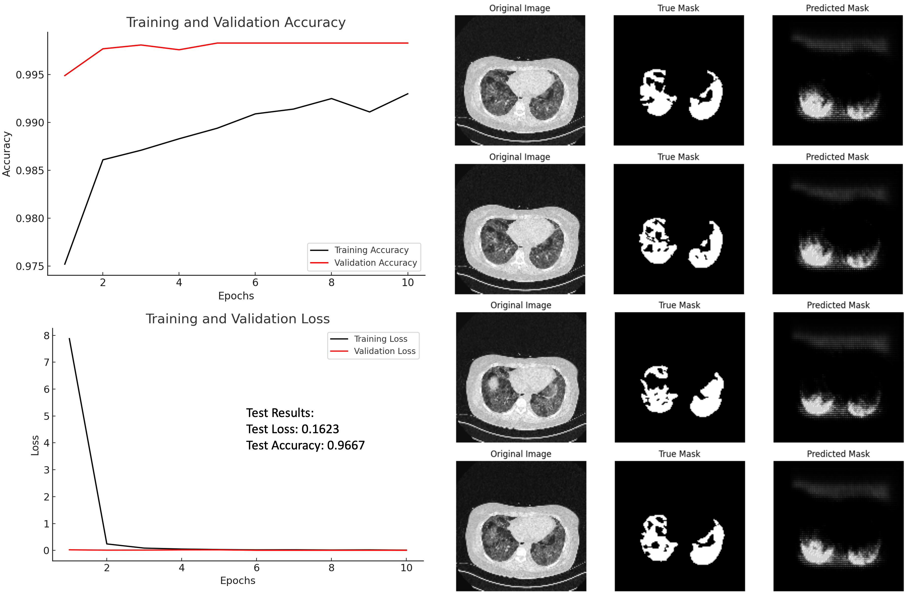
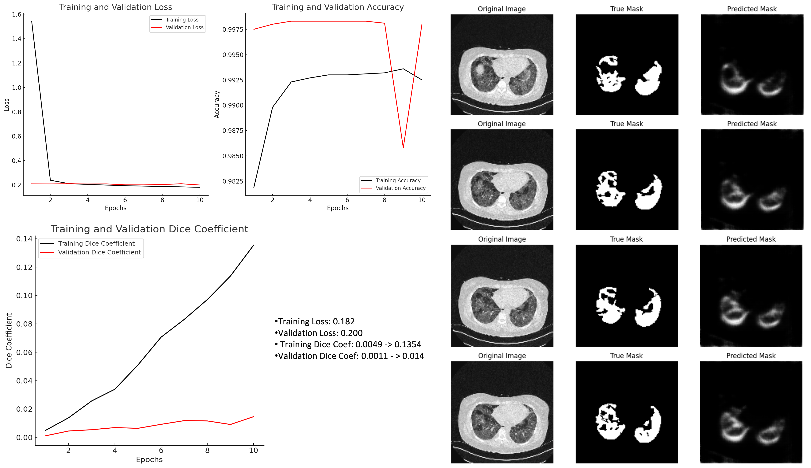

The repo contians a neural network model for accurately segmenting COVID-19 infections from 3D lung CT scans based on [COVID-19 CT Lung and Infection Segmentation Dataset](https://zenodo.org/records/3757476#.X6MgWGj7RPa). 

- Image Segmentation in medical imaging is the process of partitioning a digital image into multiple segments (sets of pixels) to simplify its representation, useful for segmenting infected areas in the lungs from CT scans for COVID-19 patients. 

- This work used the U-Net architecture, because of its proven effectiveness in medical image segmentation tasks. **Note: Techical background of the general and my custom U-Net model architecture is gven at the end of the readme file.**

- The dataset comprises 20 3D lung CT scans. 

- Each scan came with a corresponding mask named Infection masks that specifically outlined the COVID-19 infections. 

- These infections were labelled by three experienced radiologists

## **Methodology & Preprocessing Steps** 

- The preprocessing of the dataset involved several steps to convert the 3D CT scans into a format suitable for training. 

- The first step was the 3D to 2D Conversion: which involved converting the volumetric data into a series of 2D images, each representing a slice of the scan to make the training computationally less intensive 

- The next step was the 2D Resizing and Padding where the size ratios for each dimension were calculated to scale the image down or up to a target shape, 128x128 pixels in my case. 

- This padding was applied to maintain the aspect ratio so that no part of the image was lost during resizing.   

- Also, some scripting on Channel Dimension Adjustment because TensorFlow expects images to have a channel dimension, even if it's a grayscale image. 

## **Results** 
### Binary focal cross entropy

- **Training and Validation Accuracy**: Both training and validation accuracies increase over time, with validation accuracy reaching a high level and maintaining stability, which is a good sign of the model's ability to generalise. 

- The consistently high validation accuracy compared to the training accuracy suggests that the model is not overfitting.

- **Training and Validation Loss**: The training loss starts from a very high value and decreases significantly, indicating that the model is learning from the training data. 

- The validation loss also decreases and stabilises, suggesting that the model generalises well to unseen data. 

- The sharp decrease in training loss from the first to the second epoch might indicate a significant improvement in model learning, possibly due to an initially high learning rate or substantial learning in the early stages.

- The test results further validate the model's performance, showing high accuracy on the test set, demonstrating the model's effectiveness in segmenting the target objects accurately. 

### Binary focal cross entropy + Dice Loss + Data augmentations

- Both training and validation accuracies increase over time, with validation accuracy reaching a high level and maintaining stability, which is a good sign of the model's ability to generalise. 

- The consistently high validation accuracy compared to the training accuracy suggests that the model is not overfitting.

- Dice Coefficient starts at a low value of 0.0049, indicating poor overlap between predicted and actual segmentations initially. 

- However, it shows a steady increase, reaching 0.1354 by the 10th epoch, which demonstrates that the model's ability to predict accurate segmentations improves significantly with training.

- Validation Dice Coefficient also starts low at 0.0011 but increases over time to 0.0146

### Conclusions:
- The U-Net model shows promise in segmenting COVID-19 infections from CT scans, as evidenced by the high accuracy.
 
- However, the Dice coefficient's values indicate that there is significant room for improvement in accurately capturing the precise shapes and boundaries of the infections. 

- By addressing the areas for improvement, the model's performance can be enhanced and its utility in supporting medical diagnostics and treatment planning.

