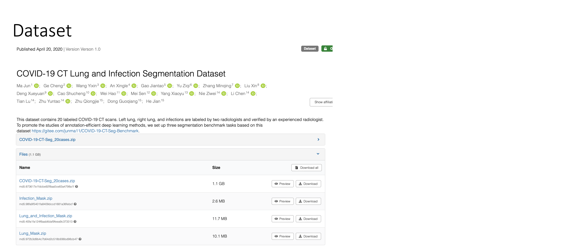

The repo contians a neural network model for accurately segmenting COVID-19 infections from 3D lung CT scans based on [COVID-19 CT Lung and Infection Segmentation Dataset](https://zenodo.org/records/3757476#.X6MgWGj7RPa).

- Image Segmentation in medical imaging is the process of partitioning a digital image into multiple segments (sets of pixels) to simplify its representation, useful for segmenting infected areas in the lungs from CT scans for COVID-19 patients. 

- This work used the U-Net architecture, because of its proven effectiveness in medical image segmentation tasks. 

- The dataset comprises 20 3D lung CT scans. 

- Each scan came with a corresponding mask named Infection masks that specifically outlined the COVID-19 infections. 

- These infections were labelled by three experienced radiologists
