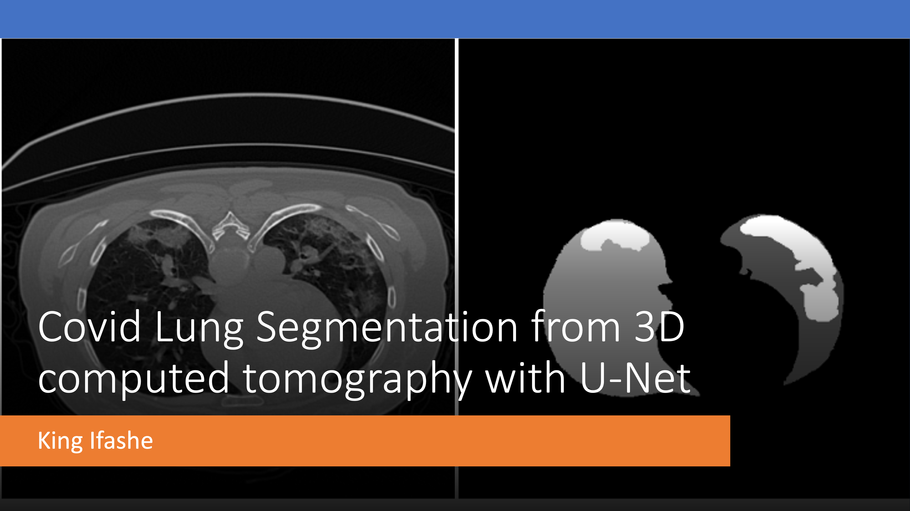

The repo contians a neural network model for accurately segmenting COVID-19 infections from 3D lung CT scans based on [COVID-19 CT Lung and Infection Segmentation Dataset](https://zenodo.org/records/3757476#.X6MgWGj7RPa). **Note: Techical background of the general and my custom U-Net model architecture is gven at the end of the readme file.**

- Image Segmentation in medical imaging is the process of partitioning a digital image into multiple segments (sets of pixels) to simplify its representation, useful for segmenting infected areas in the lungs from CT scans for COVID-19 patients. 

- This work used the U-Net architecture, because of its proven effectiveness in medical image segmentation tasks. 

- The dataset comprises 20 3D lung CT scans. 

- Each scan came with a corresponding mask named Infection masks that specifically outlined the COVID-19 infections. 

- These infections were labelled by three experienced radiologists

## **Methodology & Preprocessing Steps** 

- The preprocessing of the dataset involved several steps to convert the 3D CT scans into a format suitable for training. 

- The first step was the 3D to 2D Conversion: which involved converting the volumetric data into a series of 2D images, each representing a slice of the scan to make the training computationally less intensive 

- The next step was the 2D Resizing and Padding where the size ratios for each dimension were calculated to scale the image down or up to a target shape, 128x128 pixels in my case. 

- This padding was applied to maintain the aspect ratio so that no part of the image was lost during resizing.   

- Also, some code on Channel Dimension Adjustment because TensorFlow expects images to have a channel dimension, even if it's a grayscale image. 

